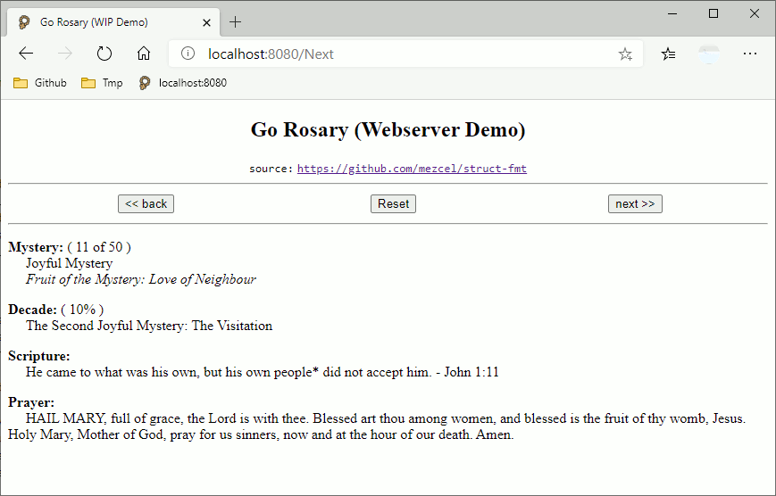

# demo

Use case demos using the ```struct-fmt``` package.

## About

* This is a cli scripture rosary app written in Go.
* The rosary database is the same ```.json``` use in [python-curses]( http://github.com/mezcel/python-curses ).
* The ```struct``` ER schema is similar to the one used in [printf-time]( http://github.com/mezcel/printf-time ).

---

## Run Demos

### tui demo

[animated terminal demo](#animated-tui-demo)

```sh
## Install struct-fmt
go get github.com/mezcel/struct-fmt

## Install nsf/termbox-go
go get github.com/nsf/termbox-go

## Run
go run main.go

## Build
go build main.go -o "myApp.exe"
```

### gui demo

[native window platform screenshots](#screenshots)

```sh
## Install struct-fmt
go get github.com/mezcel/struct-fmt

## Install andlabs/ui
go get github.com/andlabs/ui

## Install nsf/termbox-go
go get github.com/nsf/termbox-go

## Run
go run main-ui.go
```

> *Note*: ```andlabs/ui``` on Win10 will need gcc. Installing Cygwin or MSYS2 will satify this. Read the ```andlabs/ui``` code comments to see what libraries win10 libs are called if there are still issues.

### Go webserver demo

[web browser ui](#screenshots)

```sh
## Install struct-fmt
go get github.com/mezcel/struct-fmt

## Run
go run main-dom.go
```

---

## Demo App Scripts:

| script name | about |
| --- | --- |
|```structs.go```|Go Structs based on Json|
|```functions.go```|App Functions|
|```main.go```|Tui Rosary with the ```mezcel/struct-fmt``` & ```nsf/termbox-go``` packages|
|```main-ui.go```|Gui Rosary with the ```mezcel/struct-fmt``` & ```nsf/termbox-go``` & the ```andlabs/ui``` packages |
|```main-dom.go```|Webserver Rosary with just the ```mezcel/struct-fmt``` packages |

### GUI/Tui Packages

* Native GUI window: [https://github.com/andlabs/ui.git](https://github.com/andlabs/ui)
* Easily get cross platform terminal specs: [https://github.com/nsf/termbox-go.git](https://github.com/andlabs/ui)

```sh
## install the ui package dependency
go get github.com/andlabs/ui

## install the termbox-go package dependency
go get github.com/nsf/termbox-go
```

# Screenshots

Plugin: [github.com/andlabs/ui](https://github.com/andlabs/ui)
| win10 (gif) | wsl gtk (gif) | Chrome Browser (gif) |
|:---:|:---:|:---:|
||||

| CLI Terminal (asciicast) |
|:---:|
|[](https://asciinema.org/a/343751)|