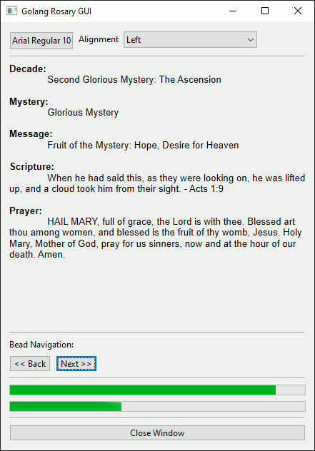
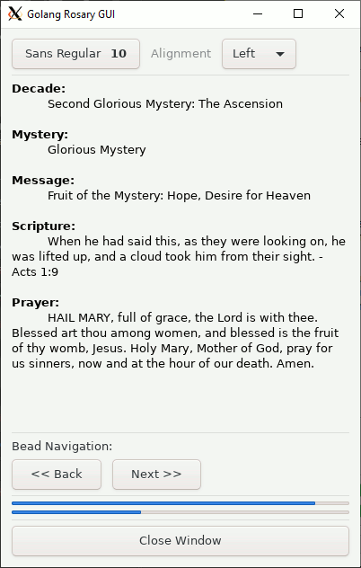

# demo

Some ( Rough and Hasty ) use case demos for the ```struct-fmt``` package.
* These demo are under developed. I was/am still learning the in's and outs of Golang. But they work and satisfy the package usecase.

## About

* Inputs a ```.json``` file and render it's contents onto a cli display using Golang with gocui.
* The primary query view mechanics are in place, the rest of the work will be in experimenting with the UI. Ultimately the UX will closely resemble [python-curses]( http://github.com/mezcel/python-curses ) and [printf-time]( http://github.com/mezcel/printf-time ).

## Objective Description

* This is a cli scripture rosary app written in Go.
* The rosary database is the same ```.json``` use in [python-curses]( http://github.com/mezcel/python-curses ).
* The ```struct``` ER schema is similar to the one used in [printf-time]( http://github.com/mezcel/printf-time ).

---

## Run Demos

### tui demo

```sh
## Run
go run main.go

## Build
go build main.go -o "myApp.exe"
```

### gui demo

```sh
## Install struct-fmt
go get github.com/mezcel/struct-fmt

## Install andlabs/ui
go get github.com/andlabs/ui

## Run
go run main-ui.go

```
> *Note*: ```andlabs/ui``` on Win10 will need gcc. Installing Cygwin or MSYS2 will satify this. Read the ```andlabs/ui``` code comments to see what libraries win10 libs are called if there are still issues.

---

## App Scripts:

| script name | about |
| --- | --- |
|```structs.go```|Go Structs based on Json|
|```functions.go```|App Functions|
|```main.go```|Tui Rosary with the ```mezcel/struct-fmt``` package|
|```main-ui.go```|Gui Rosary with the ```mezcel/struct-fmt``` & the ```andlabs/ui``` package |

### GUI/Tui Packages

* Install the ```andlabs/ui``` go package: [https://github.com/andlabs/ui.git](https://github.com/andlabs/ui)
* Install the ```nsf/termbox-go``` go package: [https://github.com/nsf/termbox-go.git](https://github.com/andlabs/ui)

```sh
## install the ui package dependency
go get github.com/andlabs/ui

## install the termbox-go package dependency
go get github.com/nsf/termbox-go
```

# Screenshots

Plugin: [github.com/andlabs/ui](https://github.com/andlabs/ui)
|win10 (gif)|wsl gtk (gif)|
|:---:|:---:|
|||

