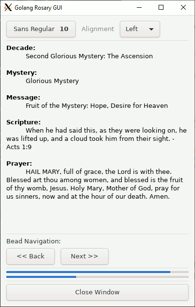
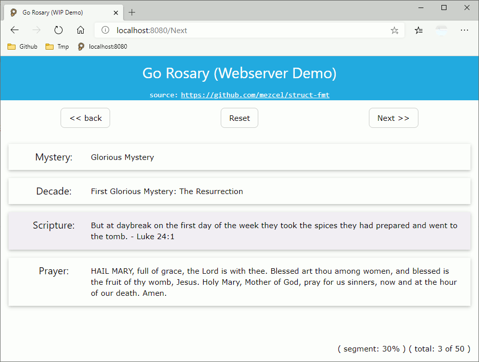

# Screenshots

## main-ui.go

* ui package
    ```go
    // go get github.com/andlabs/ui
    include "github.com/andlabs/ui"
    ```

Native desktop environment client window
* Win10 DWM
* Win10 WSL/Xorg

| Win10 DWM | Win10 WSL/Xorg (GTK) |
|:---:|:---:|
|||

## main-dom.go

Web Browser
* Edge Chromium

