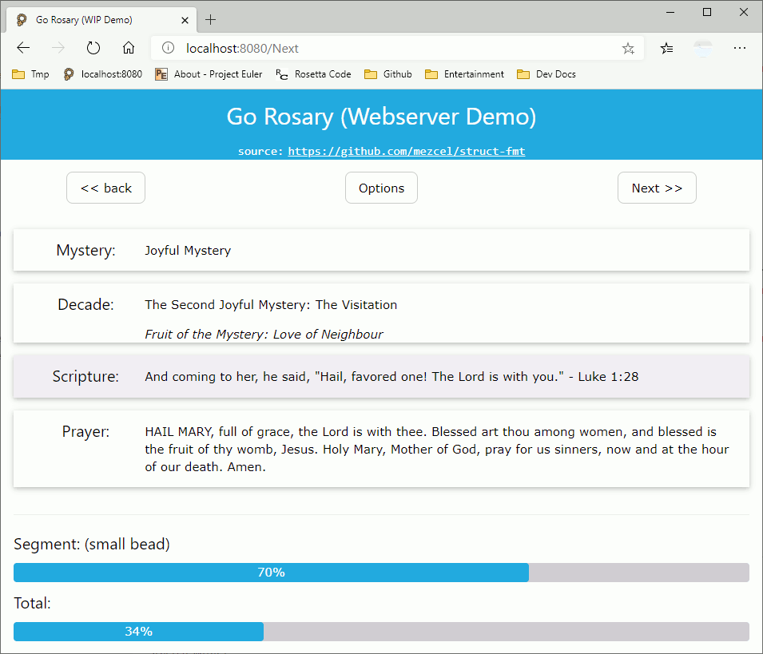

# example use cases

Use case demos using the ```struct-fmt``` package.

## About

* This is a cli scripture rosary app written in Go.
* The rosary database is the same ```.json``` use in [python-curses]( http://github.com/mezcel/python-curses ).
* The ```struct``` ER schema is similar to the one used in [printf-time]( http://github.com/mezcel/printf-time ).

---

## Run Demos

```sh
## Navigate into the repo's demo directory
cd example/

## Install prerequisites
./install.sh

## launch one of the following Go scripts
go run main.go          ## Cli/Tui Rosary with mezcel/struct-fmt package
go run main-ui.go       ## Gui Rosary with mezcel/struct-fmt & andlabs/ui package
go run main-dom.go      ## Go Webserver web page
```
---

## Screenshots (Outdated)

Gif rendered screenshots. These may not be the latest version.

| main-ui.go (win10) | main-ui.go (GTK) | main-dom.go (chromium) |
|:---:|:---:|:---:|
||||

| main.go (CLI Terminal) |
|:---:|
|[](https://asciinema.org/a/343751)|